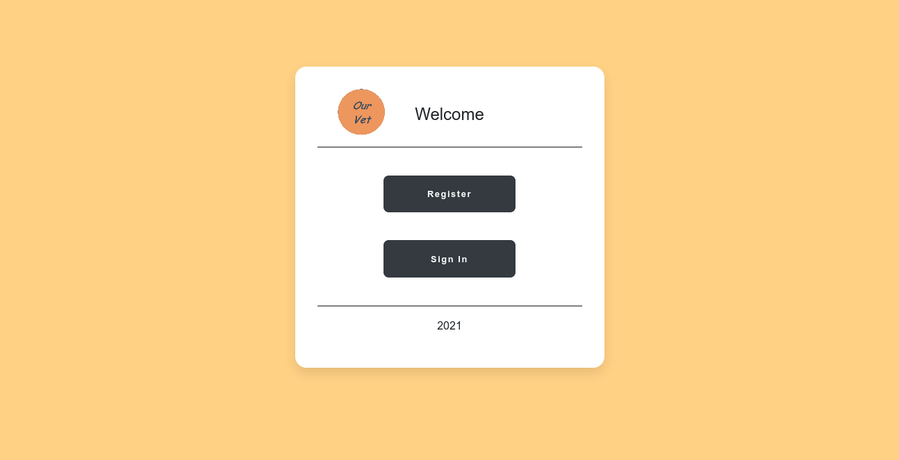

# Cara Menjalankan Project ini.

### Persyaratan

- pastikan sudah terinstall git pada device anda. periksa dengan command *git --version*
- pastikan versi php7.3 ke atas sudah terinstall pada device anda. periksa dengan command *php --version*
- pastikan composer sudah terinstall pada device anda. periksa dengan command *composer --version*

### Cara Menjalankan

- git clone https://github.com/antheiz/ourvet-app.git
- cd ourvet-app/
- composer install
- *cp .env.example .env* atau *copy .env.example .env*
- php artisan key:generate
- php artisan config:cache
- php artisan serve
- buka browser favorit kamu, dan ketik/masukan ini *http://localhost:8000* or *http://127.0.0.1:8000*
- jika sukses akan muncul seperti ini.

## License

The Laravel framework is open-sourced software licensed under the [MIT license](https://opensource.org/licenses/MIT).
